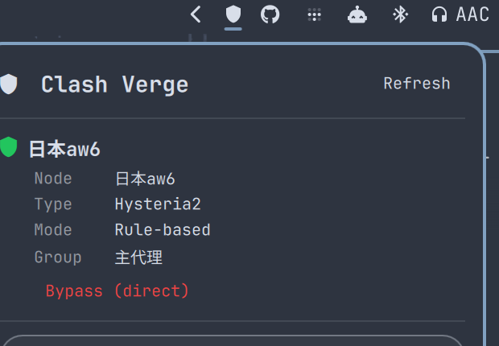

# Omarchy Clash Verge

Clash Verge status and node switching in the Omarchy bar. Shows the outbound
node your traffic is currently going through, lets you switch nodes or
bypass the proxy entirely, and exposes the rule/global mode toggle — all
talking directly to Clash Verge's own local API, no extra setup.



## Why this exists

[jkoestinger/omarchy-vpn](https://github.com/jkoestinger/omarchy-vpn) already
covers Proton VPN, Mullvad, Windscribe and NetworkManager beautifully, and
its bar-button/hero/target-list/filter interaction pattern is what this
plugin borrows. But Clash Verge isn't a VPN tunnel — it's a local proxy
individual apps opt into (or a TUN device, if you have that on), it doesn't
exclude a real VPN the way a tunnel does, and "connected" means "the proxy
is actively routing traffic," not "a tunnel is up." That's a different
enough model that it didn't make sense as a fifth backend bolted onto that
project's `VpnController` — see `model/Clash.js`'s header comment for the
longer version.

## How it talks to Clash Verge

Clash Verge exposes a REST API over a local unix socket
(`/tmp/verge/verge-mihomo.sock`) — no TCP port, no secret to configure. This
widget:

- `GET /configs` — reads `mode` (`rule` / `global` / `direct`)
- `GET /proxies/<selector group>` — reads the active node and the list of
  choices in your main selector group
- `GET /proxies` — reads every proxy's type, to label group members
  ("Hysteria2", "auto-select group", …) in the target list
- `PUT /proxies/<selector group>` — switches the active node
- `PATCH /configs` — flips `mode` (bypass / restore / global toggle)

## Requirements

- Omarchy Quattro with shell plugin support
- [Clash Verge](https://github.com/clash-verge-rev/clash-verge-rev) running,
  with its socket at the default path

## Install

```bash
omarchy plugin add https://github.com/jackzasian/omarchy-clash-verge.git --enable
```

## Settings

| Setting | Default | Description |
|---|---|---|
| Refresh interval | 15s | How often the widget re-polls Clash Verge |
| Selector group name | `主代理` | The proxy group in your config that picks the outbound node. Falls back to `GLOBAL` automatically if this name isn't found — most default Clash Verge profiles use `GLOBAL` directly, so set this to `GLOBAL` (or clear it) if your config doesn't have a custom main selector. |

## Tests

The parsing and row-building logic lives in `model/Clash.js`, tested without
a QML engine:

```bash
node tests/run.js
```

```bash
cd .. && qmllint -I /usr/share/omarchy/shell omarchy-clash-verge/Panel.qml
```

(Run from outside the plugin directory — `qmllint` treats the directory it's
pointed at as an implicit import, which makes `Panel.qml`, a `Panel` deriving
from `qs.Ui`'s own `Panel`, resolve to itself. Not a defect in the file being
checked — same note as jkoestinger/omarchy-vpn's own `ARCHITECTURE.md`.)

## License

MIT
