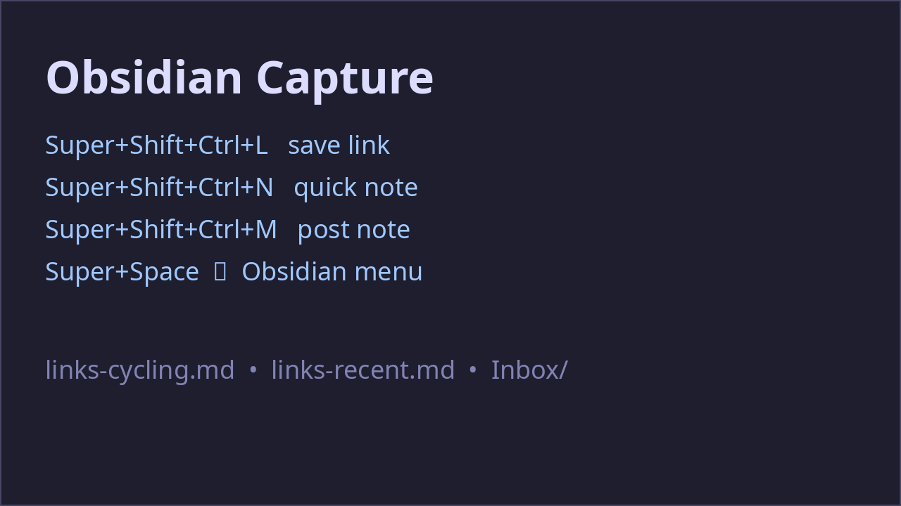

# Omarchy Obsidian Capture

Save **links** and **quick notes** into an Obsidian vault from any app — hotkeys,
the Super+Space Omarchy menu, a newest-first recent-links feed, and optional
Zen Browser bookmark sync + vault git push.

Built for Arch + Omarchy (Hyprland + Quickshell menu). The capture CLI is plain
Python 3 and only depends on the Omarchy menu (`omarchy-menu-input` /
`omarchy-menu-select`) for its interactive prompts.



---

## What you get

| Command | What it does |
|---------|--------------|
| `obsidian-capture link` | Clipboard / argv / prompt URL → `Links/<topic>.md` + recent feed |
| `obsidian-capture note` | Short note → `Inbox/` |
| `obsidian-capture edit` | Multiline note (zenity) → `Inbox/` |
| `obsidian-capture web` | Short note → j4c1cz.com/notes |
| `obsidian-capture dest` | Note, then pick inbox / site / both |
| `obsidian-capture recent` | Open the recent-links feed in Obsidian |
| `obsidian-capture sync` *(optional)* | Pull new Zen Browser bookmarks into `Links/links-inbox.md` |
| `obsidian-capture push` *(optional)* | Commit + push `Links/` to the vault's git remote |

Plus:

- **Keybindings** (installed automatically):
  - `Super+Shift+Ctrl+L` — save link
  - `Super+Shift+Ctrl+N` — quick note
  - `Super+Shift+Alt+N` — multiline note
  - `Super+Shift+Ctrl+M` — post note to j4c1cz.com
  - `Super+Shift+Ctrl+,` — note, then choose destination
- **Omarchy menu** — an `Obsidian` submenu in Super+Space (search "link").
- **Weekly timers** *(optional)* — Zen sync Sun 20:00, vault push Sun 20:15.

Legacy script names (`obsidian-save-link`, `obsidian-save-note`,
`obsidian-post-note`, `obsidian-note-dest`, `obsidian-save-note-edit`) are
installed as thin aliases that route to the same CLI.

---

## Install

### As an Omarchy plugin (recommended)

```bash
omarchy plugin add https://github.com/jackzasian/omarchy-obsidian-capture.git --enable
```

The plugin's service runs an idempotent installer once: it symlinks the CLI
into `~/.local/bin/`, merges the `Obsidian` menu entries into
`~/.config/omarchy/extensions/omarchy-menu.jsonc`, and adds a
`require("obsidian-capture")` line to `~/.config/hypr/bindings.lua`.

### Manually

```bash
git clone https://github.com/jackzasian/omarchy-obsidian-capture.git
cd omarchy-obsidian-capture
./install.sh            # CLI + menu + keybindings + optional timers
./install.sh --no-timers   # same, without systemd timers
```

---

## Configuration

Everything is overridable via environment variables:

| Variable | Default | Used by |
|----------|---------|---------|
| `OBSIDIAN_VAULT_DIR` | `~/Obsidian/J4c1c` | link, note, recent, sync, push |
| `OBSIDIAN_LINKS_DIR` | `<vault>/Links` | link, recent, sync |
| `OBSIDIAN_INBOX_DIR` | `<vault>/Inbox` | note, edit |
| `OBSIDIAN_VAULT_NAME` | `J4c1c` | obsidian:// URIs |
| `OBSIDIAN_ZEN_ROOT` | `~/.config/zen` | sync |
| `OBSIDIAN_VAULT_BRANCH` / `OBSIDIAN_VAULT_REMOTE` | `main` / `origin` | push |
| `NOTES_TOKEN` / `NOTES_API_URL` / `UPSTASH_REDIS_REST_*` | — | web, dest (site) |

Web-note publishing reads env files from `~/Developer/j4c1cz/.env.local` and
`~/.config/j4c1cz/notes.env` (override with `J4C1CZ_REPO_ENV` /
`J4C1CZ_NOTES_ENV`). It posts via the notes API, falling back to Upstash.

### Vault layout expected

```
Obsidian/<Vault>/Links/
  links-cycling.md   links-study.md   links-tech.md
  links-projects.md  links-misc.md   links-inbox.md
  links-recent.md          # created on first save if missing
Obsidian/<Vault>/Inbox/   # note + edit targets
```

---

## Development

```bash
PYTHONPATH=bin pytest -q          # unit + smoke tests (no network)
omarchy plugin validate .         # plugin manifest check
```

## License

MIT