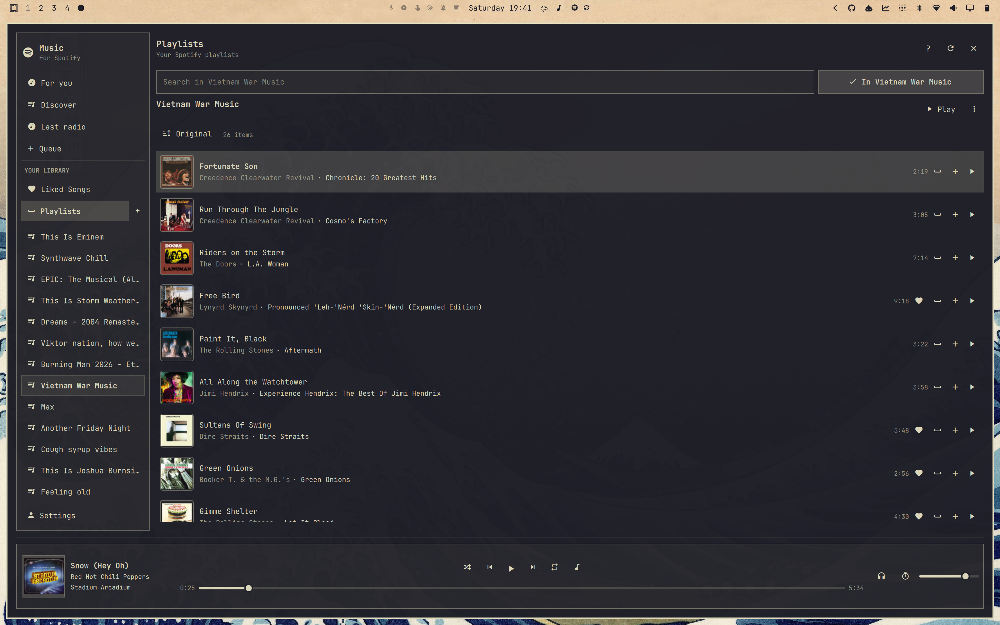
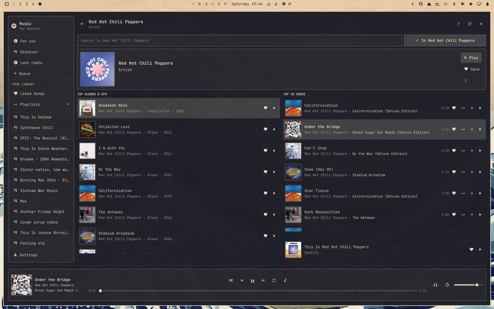
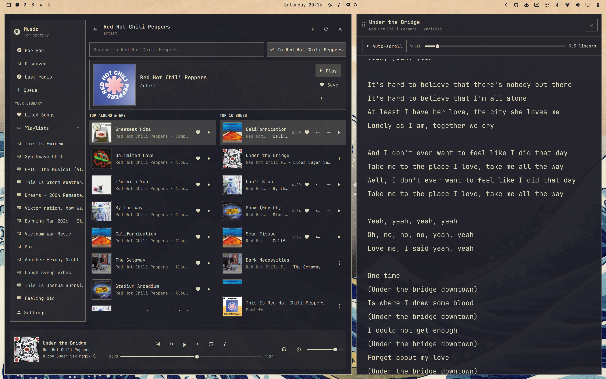
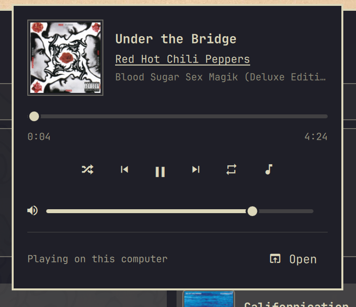

# Omarchy Spotify

**Spotify in Quickshell—not Chromium.**

Omarchy Spotify brings the Spotify experience you already know into a fast,
beautiful Omarchy plugin. It uses about **60 MB of RAM** instead of roughly
**950 MB** for the Spotify desktop client, follows your active Omarchy theme,
and keeps your music close with an integrated mini player.

Pair it with **Omasing** and lyrics for the song you are playing are fetched
for you, ready when you want them.

## Why you will love it

- **Lightweight by design.** Enjoy your music without keeping a browser-sized
  desktop client running.
- **Made for Omarchy.** Every color follows your current theme automatically,
  including light themes.
- **Always within reach.** Play, pause, skip, seek, change volume, or open
  lyrics from the mini player in your bar.
- **Your full music library.** Search Spotify, browse artists and albums,
  manage playlists and the queue, and move playback between Spotify Connect
  devices.
- **Lyrics with Omasing.** Open the current song in Omasing and let it find the
  right lyrics and playback position automatically.

## Familiar from the first click

The layout is inspired by the Spotify client, so there is almost nothing new
to learn. Your library and playlists live in the sidebar, search stays at the
top, the player stays at the bottom, and artist and album names take you
straight to their pages.

Prefer to keep your hands on the keyboard? The whole app is designed for that
too.

| Shortcut | What it does |
| --- | --- |
| `Ctrl+K` or `/` | Jump to search |
| `Ctrl+F` / `Ctrl+L` | Search this page / all of Spotify |
| `Space` | Play or pause |
| `Ctrl+Left` / `Ctrl+Right` | Previous or next song |
| `Shift+Left` / `Shift+Right` | Seek 10 seconds |
| `Ctrl+Up` / `Ctrl+Down` | Change volume |
| `M` | Mute or restore volume |
| `Ctrl+/` | See every keyboard shortcut |

The mini-player takes keyboard focus when it is opened from a shortcut. Use
`Tab` or the arrow keys to select every control, `Enter` to activate buttons,
left/right to adjust a selected slider, and `Esc` to close. The playback
shortcuts above work there too; `Ctrl+S` toggles shuffle, `Ctrl+R` cycles
repeat, `Ctrl+Shift+L` opens lyrics, and `O` expands the full player.

## See it in action

### Your playlists, instantly familiar

Everything is where you expect it to be—just faster, lighter, and dressed in
your Omarchy theme.



### Everything from an artist, in one view

Top albums and EPs sit beside the artist's ten biggest songs, with their
**This Is** playlist and full catalog only a search away.



### Lyrics, already matched to the song

One click sends the current track to Omasing, where the lyrics are fetched and
lined up with your playback position—ready to auto-scroll as you listen.



### A mini player that belongs in your desktop

The essentials are always one click away, without reopening the full app.



## Add it to Omarchy

```bash
omarchy plugin add https://github.com/stappmus/Omarchy-Spotify.git --enable
```

To replace Omarchy's existing **Super+Shift+M · Music** binding, add this to
`~/.config/hypr/bindings.lua`:

```lua
  hl.unbind("SUPER + SHIFT + M") -- previously: Music
  o.bind("SUPER + SHIFT + M", "Omarchy Spotify",
    "omarchy shell -q quickshell.spotify.player togglePlayer")
```

Run `hyprctl reload` and check `hyprctl configerrors` after saving. In Omarchy
Spotify's Settings, choose whether that shortcut launches Omarchy's default
music app, toggles the full player, or toggles the mini-player. Separate
bindings can call `toggleMiniPlayer` or
`toggleFullPlayer` on the same `quickshell.spotify.player` target.

Click the Spotify icon on the left side of the bar, choose **Set up and
continue**, and finish the Spotify sign-in in your browser. You can move the
widget later with Omarchy's bar controls.

> Requires Omarchy 4 and a personal Spotify Premium account.

## More music, less app

- Discover Weekly, Release Radar, Daily Mixes, daylist, and more in **Discover**.
- Browse Liked Songs, saved albums, followed artists, podcasts, and books.
- Create playlists, add songs, reorder tracks, and turn followed playlists
  into your own editable copies when Spotify makes their contents available.
- Build a queue, start track radio, use shuffle and repeat, or set a sleep timer.
- Listen on this computer or switch to another Spotify Connect speaker or player.
- Choose the mini-player or full player independently for the bar icon and
  keyboard shortcut, show the title, artist, or both, and softly scroll
  overflowing text at an adjustable speed.
- Choose up to 320 kbps for local playback.

Your Spotify password is entered only on Spotify's own page. Omarchy Spotify
stores your saved session in GNOME Keyring and clears it when you log out.

Want the details? Read the [technical notes](docs/TECHNICAL.md) or see the
[memory benchmark](docs/BENCHMARK.md).

Omarchy Spotify is an independent project and is not affiliated with Spotify.
Spotify is a trademark of Spotify AB.

Licensed under the [MIT License](LICENSE).
